<!-- ════════════════════════════════  HERO  ════════════════════════════════ -->

  
  
<i>Building seamless cross-platform experiences, scalable cloud solutions, and vibrant tech communities.</i>

  
<a href="https://apurba2509-portfolio.vercel.app"><b>apurba2509-portfolio.vercel.app</b></a> · projects, journey &amp; contact

  

    <a href="https://apurba2509-portfolio.vercel.app"></a>
    
    
    <a href="https://github.com/Apurba2509?tab=repositories"></a>
  

  

    <!-- counters.svg (reach strip) is rebuilt by the workflow; edit REACH in scripts/build_assets.py for LinkedIn/Instagram. The 1px komarev image keeps counting visits -->
    
    
  

<!-- ═══════════════════════════════  WHOAMI  ═══════════════════════════════ -->


I'm a developer & BCA student at <b>Techno Main Salt Lake</b>, bridging the gap between <b>engaging UI</b> and <b>robust backend architecture</b>. 
I love taking projects from <b>0 → 1</b> — architecting a mobile app, configuring AWS/GCP infrastructure, or organizing large-scale tech events.

<!-- ═════════════════════════  HACKATHONS & BUILDS  ═════════════════════════ -->

<table align="center">
  <tr>
    <td width="50%" valign="top">
      <h3>🌋 DisasterOps</h3>
      
Prototyped for the <b>Google Solution Challenge 2026</b>.

      
    </td>
    <td width="50%" valign="top">
      <h3>🇮🇳 Smart India Hackathon</h3>
      
Competed and presented team prototypes at <b>SIH</b>.

      
    </td>
  </tr>
  <tr>
    <td width="50%" valign="top">
      <h3>⚔️ HackForge</h3>
      
Hackathon at <b>Srijan '26</b>.

      
    </td>
    <td width="50%" valign="top">
      <h3>🛰️ Orbit AI · 📣 Civic Reporter</h3>
      
Custom UI/UX built in <b>Android Studio</b> and <b>React Native</b>.

      
      
    </td>
  </tr>
</table>

<!-- ═══════════════════════  OPEN SOURCE & COMMUNITY  ═══════════════════════ -->

<table align="center">
  <tr>
    <td width="50%" valign="top">
      <h3>🌱 Open Source</h3>
      <ul>
        <li><b>GSSoC '26</b> & <b>Apertre 3.0</b>: contributing as a mentee & selected contributor</li>
        <li><b>MapifyOS</b>: pull requests for <b>OSCG '26</b></li>
      </ul>
    </td>
    <td width="50%" valign="top">
      <h3>🎤 Community</h3>
      <ul>
        <li><b>GDG On-Campus TMSL</b>: Social Media Head & PR Core</li>
        <li><b>TechSprint</b>: co-organized GDG TMSL's inaugural hackathon</li>
        <li><b>QZone</b>: Joint Head</li>
        <li><b>Google Cloud Arcade</b>: Co-Facilitator, 2026 Cohort</li>
      </ul>
    </td>
  </tr>
</table>

<!-- ═════════════════════════════  TECH ARSENAL  ═════════════════════════════ -->

  <code>Frontend & Mobile</code>  
  
    
  <code>Backend, Cloud & Databases</code>  
  
    
  <code>Tools & Languages</code>  
  

<!-- ═══════════════════════════  GITHUB TELEMETRY  ═══════════════════════════ -->

<!-- stats.svg + snake are regenerated every 12h by .github/workflows/profile-assets.yml -->

  
    
  <picture>
    <source media="(prefers-color-scheme: dark)" srcset="https://raw.githubusercontent.com/Apurba2509/Apurba2509/output/snake-dark.svg" />
    <source media="(prefers-color-scheme: light)" srcset="https://raw.githubusercontent.com/Apurba2509/Apurba2509/output/snake-light.svg" />
    
  </picture>

<!-- ═════════════════════════  ACHIEVEMENTS UNLOCKED  ═════════════════════════ -->

  

 

<!-- DAILY:START (rewritten by .github/workflows/daily-readme.yml — edit quotes in scripts/daily_update.py) -->

💬 <i>"First, solve the problem. Then, write the code."</i> — John Johnson

<!-- DAILY:END -->

